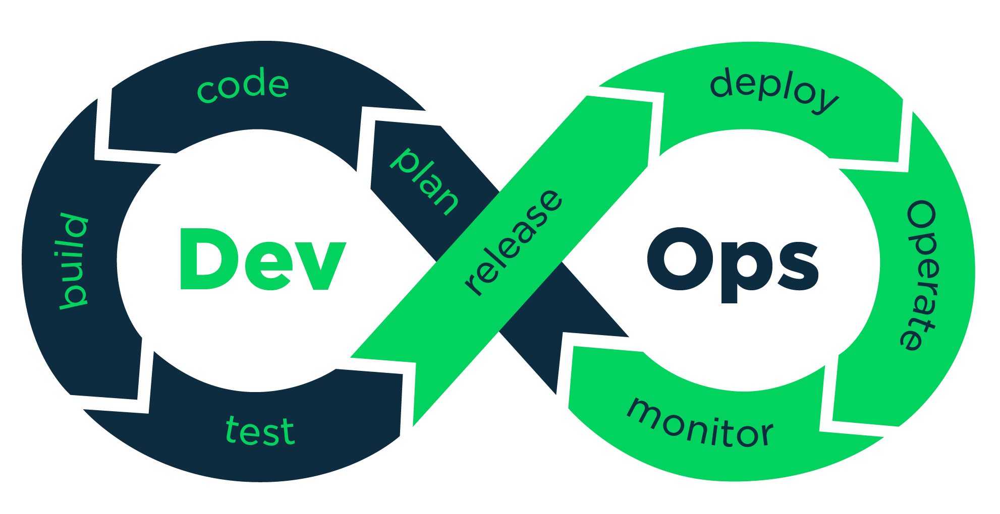
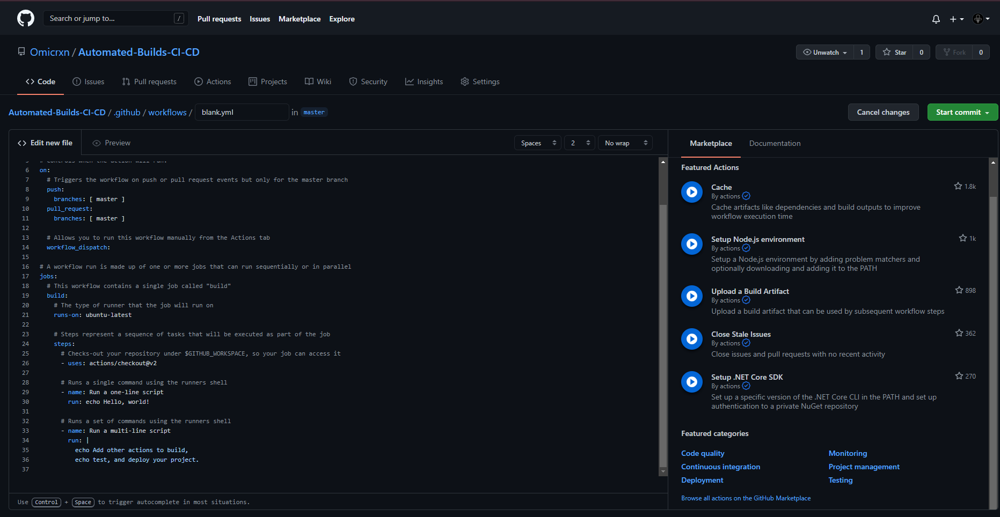

This is a research created by Alejandro Ávila Rodríguez ([Omicrxn](https://github.com/Omicrxn)) for Project II subject in the Bachelor's degree in Videogame Design and Development at UPC/CITM University. The teacher supervising this project is Ramon Santamaría ([Raysan5](https://github.com/raysan5)). You can find the presentation [here](Presentation/automated_builds.pdf)

# Automated Builds and DevOps
The process of building in software development describes the conversion of files and other assets to create a software product that works in its intended final form. Although it can differ between programming languages or frameworks, this procedure includes compiling source files, packaging compiled files into compressed formats, producing installers and creating or updating database schemas if needed. Hence, automated builds are generated whenever the prerequisites mentioned above can be repeated at any time, do not require human intervention, and only use the information contained in the source code. Build automation is a prerequisite to Continuous Integration since it is used by CI to detect issues early, which allows Continuous Testing and Continuous Delivery to be possible, however, this will be seen further in the research. The combination of those three processes along with other practices and tools that allow organizations, teams and developers to deliver software faster and more efficiently than in traditional development is named DevOps. To sum up, DevOps is a group of techniques in which automated builds, CI and CD are contained that allow developers to deploy high-speed quality products.


# What is CI/CD
CI/CD pipelines are one of the best practices for DevOps because they deliver code changes with more reliability and speed. Continuous integration (CI) and continuous delivery (CD) are a set of practices that make it possible for developers and teams to deliver more solid code changes and with more regularity. This method is also known as CI/CD pipeline allows developers to focus on quality, requirements and security since the building and deployment are automated. A Continuous Integration process is a software development procedure in which all code changes are merged into a central repository multiple times a day.  Continuous Delivery is a project management practice that automates the entire release process in addition to Continuous Integration.

# Elements of a CI/CD Pipeline

A CI/CD pipeline is a proven set of processes that allow developers to deliver new versions of software. Those steps would still have to be performed by humans if there were no automated pipeline. There are commonly a couple of stages involved in software releases:
## Source stage
The pipeline run is initiated by a source code repository. Whenever a change in code is detected the CI/CD tool runs the pipeline. Furthermore, triggers can be automatically scheduled or initiated  by the user.
## Build stage
We merge the source code and its dependencies to create a working version of our software that we will ultimately deliver to our customers. Depending on the programming language we use, compilation may be required or not in this step. Cloud-native software is typically deployed with Docker, which is a service that allow us to deliver software packages (called containers) which are isolated between them. This allow us to separate our applications from our infrastructure to deliver the product quickly.
## Test stage
During this stage, we execute automated tests to verify the validity of our program and the functionality of our service. This stage serves as a protective shield, preventing quickly reproducible errors from affecting consumers. It is the developers' duty to write the tests and it is a great practice to do so while we are adding new features to the program.
## Deploy stages
Finally, now that we have a build that has passed all our tests we are ready to deploy the program. The software can be deployed to the users in a production state or it can also be deployed internally as an alpha or a beta. 


# Why use a CI/CD pipeline
Using a pipeline can bring to the team and to the final product a lot of benefits. The most notorious one is that developers don't need to lose time doing all those steps since it is automated and they can focus on other things like improving the code quality, or writing new features. It is also beneficial to the QA team since they can have access to the latest version of the system which has passed all the tests set by the developers and that means that some errors have already been taken care of. CI/CD pipelines allow to roll back to a previous version very easily.

# Market Study: Choosing the best CI/CD tool
Recently, DevOps have been given more and more importance and thanks to that many tools to help with your deployments have appeared. The tool you choose may depend on your project needs, programming language or your personal preference. However, some of the best choices to look at are:

## 1. [GitHub Actions](https://github.com/features/actions)
GitHub Actions is a CI/CD tool provided within GitHub. Workflows can be automated, customized, and executed right within GitHub repositories, which added to the generous free tier makes GitHub Actions the best tool for testing CI/CD pipelines and for small projects. The free plan includes a 500 Mb storage and 2.000 minutes per month (minute consumption may be different from one OS to another). However it includes more pricing plans to adapt to your necessities. You can calculate the minute and storage spending as well as other information for the plans at the following [Link](https://docs.github.com/en/github/setting-up-and-managing-billing-and-payments-on-github/about-billing-for-github-actions#calculating-minute-and-storage-spending).


## 2. [Jenkins](https://www.jenkins.io)

Jenkins is an open-source and free automation server where the central build and CI process takes place. It supports the construction, deployment and automation of your projects helped by hundreds of plugins. Some of the key features are that it is has a really easy installation in the most used OS, its interface is really userfriendly, it has a huge growing community which at the same time develops plugins to use in Jenkins.


## 3. [CircleCI](https://circleci.com)
This tool enables automation across the user's pipeline in all the stages. One key benefit of it is that you can easily integrate CircleCI with GitHub and Bitbucket to create builds whenever you push a new commit with new code lines. It uses a container or virtual machine to build, it has fast testing and deployment is continuous and branch-specific. Another great feature of it is that it is quite customisable and has a fast setup and unlimited construction. It has three plans, one free, one starting at 30$/month and another customizable plan to support enterprise needs. The free plan however is good for simple projects or testing, it can only run 1 job at a time and has a 2,500 free credits a week (credits are used to pay for the team's usage). If your project is Open-Source it also offers three more free containers.


## 4. [GitLab](https://about.gitlab.com)

GitLab is another popular tool for DevOps which is based on the web and also features a Git repository manager. It is a platform for automating developer workflows and CI/CD is just one of the many workflows it offers. It has a very competitive free plan bringing you most of GitLab's potential with 400 minutes of CI/CD per month. It may be another great option for beginners who want to get their hands dirty on the DevOps world without paying.


# Setting Up a CI/CD environment with GitHub Actions
Even though there are multiple tools reviewed above, this explanation will be shown using GitHub Actions. However it is highly encouraged to do your own research of other tools that may adapt to your needs better.

## Basic Concepts of GitHub Actions
Before we start creating our actions and pipelines, I will review the basic concepts of GitHub Actions in order to understand better the steps to create our pipeline.

### Workflows
Developers use several workflows along the development process and even though tools like Git and GitHub makes our life easier, there are still a lot of tasks that require our time. For instance, if someone creates an issue we still have to rate it as a minor/major bug, assign it to a contributor, review the pull request, see if the bug is fixed, prepare the release note, and a lot of tasks that follow such as the testing, building and deployment. A repository can have multiple contributors that would make the task of reviewing issues really time-consuming and complicated, so for problems like this example, GitHub Actions comes to the rescue. In GitHub Actions you can create your workflows where you can listen to Events and run Jobs. This way we can forget about tasks like the issue reviewing, the building of our repository or the deployment. Furthermore, GitHub Actions has a lot of presets with a huge variety of combinations based on languages, tools, frameworks...
### Events
An event is an activity that triggers a workflow. You can have events for things as Issue creation, Pull request merging, commits and a lot of other events that are listed on the docs in the following [link](https://docs.github.com/en/actions/reference/events-that-trigger-workflows).
### Jobs
Jobs are the actions performed when an event is triggered. Jobs run in parallel by default but they can also run sequentially if you define dependencies on other jobs.
### Steps
As the name indicates the steps are the sequence of tasks that a job should perform. The tasks are divided into actions and commands. Actions are specific tasks that may depend on your purposes and commands are OS terminal code lines that you can run from GitHub Actions. An important thing to note is that GitHub has a repository with a lot of premade actions that can be checked [here](https://github.com/actions).

## Setting Up Actions
### Step 1
First of all we should be in our repository on GitHub and click the Actions button as seen in the image below(its location might change in the future). This will take us to the GitHub Actions start panel.


### Step 2
In the Get Started screen of GitHub Actions you can find a lot of preset workflows for CD, for CI and for other events or purposes inside GitHub like handling issues. You may choose the one that fits best with your objectives and project or create your own workflow. For demonstration purposes I used the basic workflow available in the Continuous Integration section.


### Step 3
Now that we chose our workflow template, this specific workflow does a checkout of our repo and runs a set of commands using the OS shell.


### Step 4 
Actually that is all we need to do to successfully have our GitHub Actions ready to go but I am going to analyse the code to let you know how it is structured. The workflow code is shown in the image below. First of all the **name** fields are optional and just for describing or naming the part of the code you are running. Then we find the **on**, inside of it we will have the events that we want to listen for. As we can see we are listening for a **push** or a **pull_request** on the master branch. **Workflow_dispatch** is used to specify workflows that are manually triggered. Now for our second main part of the code, the **jobs** section is where we will list the actions that we want to be triggered when our events happen. In this case it will **build** our workflow on a server that **runs-on** ubuntu in the latest version, we can specify here any OS or even multiple of them. Finally the next section of our **jobs** is the **steps**. Here we list the actions or commands that we want to be executed, in this example we run some commands on the OS shell. 


### Step 5
After our workflow code is correct, we proceed to do a commit. In this case since the commit will also push the code to our repository, the workflow will be activated.


### Step 6 
To check if our Workflow works correctly, we need to go to the Actions tab again and instead of the Get started page we will see our Workflows page. On the right side we will have a list of all our workflows and in the centre we will have the runs executed by our workflow.


### Step 7
If we click on our workflow run, we will see if there have been any errors or if it was successfully built.


# Bonus: GitHub Actions to create an automatic release.
As a bonus section, I am going to explain how to use the above process to automatically create a release.
To begin with, I expect that the above Workflow has been implemented, if you haven't already, please do before continuing with the explanation. After we have our starter workflow enabled and running, we can modify it by changing the *.yml* file generated on our repo following the path (.github/workflows). For this Actions we will use two premade Actions on the GitHub [marketplace](https://github.com/marketplace): [Zip Release](https://github.com/marketplace/actions/zip-release) and [Create Release](https://github.com/marketplace/actions/create-release). We will use those Actions by using the command **uses** under our steps section. It works as a library would work in other programming languages. The workspace should look as follows: 
```yml
# This is a basic workflow to generate a zip and a release using GitHub Actions

name: Release Generator

# When a new push with a tag is called, the event is triggered
on: 
  push:
    branches:
      - master
    tags:
      -v1.*

jobs:
  # This workflow contains a single job called "build"
  build:
    # The type of runner that the job will run on
    runs-on: ubuntu-latest

    # Steps represent a sequence of tasks that will be executed as part of the job
    steps:
      # We are generating the zip excluding the gitignore (or any other file specified in the exclusions)
     - uses: actions/checkout@v2
     - name: Zip Generator
       uses: thedoctor0/zip-release@master
       with:
        filename: 'release.zip'
        exclusions: '*.gitignore*'
      # Creates a release uploading the release.zip file. The github token is usually under secrets.GITHUB_TOKEN, however in the future this may be different.
     - name: Create Release
       uses: ncipollo/release-action@v1
       with:
        tag: $
        artifacts: "release.zip"
        token: ${{ secrets.GITHUB_TOKEN }}
```
# Webgraphy
[Agile Alliance: Automated Builds](https://www.agilealliance.org/glossary/automated-build)  
[Perforce: Build Automation 101](https://www.perforce.com/blog/vcs/build-automation)  
[Synopsys: DevOps](https://www.perforce.com/blog/vcs/build-automation)  
[GitHub Actions Tutorial-Basic Conecpts and CI/CD Pipeline with Docker](https://www.youtube.com/watch?v=R8_veQiYBjI&ab_channel=TechWorldwithNana)  
[dawntraoz](https://www.dawntraoz.com/blog/how-to-add-ci-to-frontend-project-with-github-actions/)  
[Medium:What is CI/CD Pipeline](https://medium.com/@nanduribalajee/what-is-ci-cd-pipeline-e2f25db99bbe)  
[Medium: DevOps is a culture, not a role](https://medium.com/@nanduribalajee/what-is-ci-cd-pipeline-e2f25db99bbe)  
[GitLab](https://about.gitlab.com)  
[Jenkins](https://www.jenkins.io)  
[CircleCI](https://circleci.com)  
[GitHub Actions](https://github.com/features/actions)  
[How to set Up a CI/CD Pipeline](https://enterprisersproject.com/article/2020/1/cicd-pipeline-how-set-up)  
[Semaphoreci: CI/CD Pipeline: A Gentle Introduction](https://semaphoreci.com/blog/cicd-pipeline)  
[SmartBear: The Key to an Effective CI/CD Pipeline: Automated Testing](https://smartbear.com/learn/automated-testing/the-continuous-development-pipeline/)  
